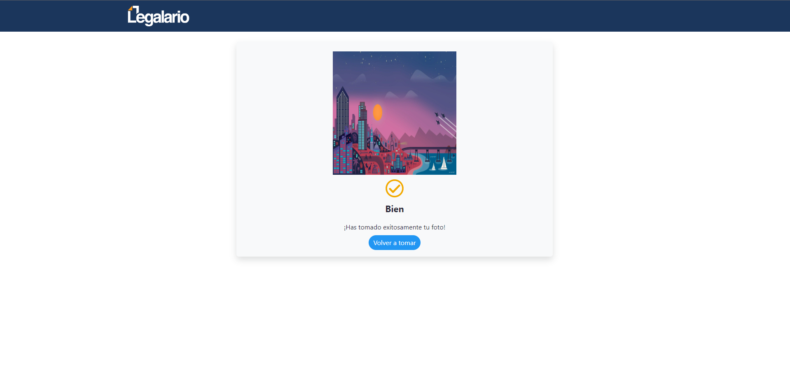

# Aplicación para tomar y subir fotos - Prueba técnica (Frontend)

## Para el desarrollo de la aplicación se utilizo el framework angular en su versión 15.

### Requisitos necesarios: 

* Angular V15+
* Node JS V16+

Para poder levantar el proyecto es necesario realizar las siguientes instalaciones:

#### Instalar CLI Angular
* [Angular CLI](https://docs.angular.lat/guide/setup-local)

#### Instalar Node JS
* [Node JS](https://nodejs.org/es/)

Una vez finalizadas las instalaciones, se procede abrir el proyecto, pero antes de levantarlo es necesario de instalar las dependencias con la siguiente línea de comando:

`` npm install ``

Una vez realizada la instalación de las dependencias, se podrá levantar el proyecto con la siguiente línea de comando:

`` ng serve ``

Para visualizar el proyecto por favor ingresar a la siguiente liga:

http://localhost:4200/

## Pantallas de la aplicación 

### Escritorio
Pantalla inicio cuando no se dieron los permisos de cámara (Solo se permite seleccionar foto)

Pantalla inicio cuando se dieron

Pantalla vista previa

 

 Pantalla éxito 

  

  ### Móvil
Pantalla inicio cuando no se dieron los permisos de cámara (Solo se permite seleccionar foto)

Pantalla inicio cuando se dieron

Pantalla vista previa

 

 Pantalla éxito 

  

